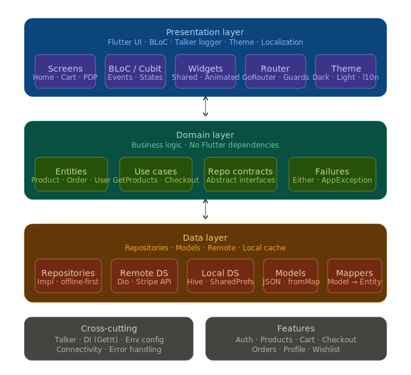

# ShopFlow

Production-grade Flutter e-commerce **freelance showcase** — Clean Architecture, BLoC, Hive offline-first, Stripe, Talker logging, AR/EN localization, and responsive navigation across mobile, tablet, and desktop.


> **Demo GIF:** Record a screen capture and save to `docs/demo.gif`, or replace this link with your hosted GIF URL.

---

## Architecture



```
Presentation (BLoC/Cubit) → Domain (Use Cases) → Data (Repositories + Hive/Dio)
```

- **Domain** has zero Flutter imports — pure Dart + `Either<Failure, T>`
- **Features** are self-contained: `auth`, `products`, `cart`, `checkout`, `orders`, `profile`, `wishlist`
- **Core** holds DI, router, theme, network, l10n, shared widgets

---

## Features

| Feature | Status |
|---------|--------|
| Email/password auth + session restore | ✅ |
| Google Sign-In (showcase stub) | ✅ |
| JWT refresh on 401 (showcase stub) | ✅ |
| Secure token storage (`flutter_secure_storage`) | ✅ |
| Product catalog — search, filter, grid/list toggle | ✅ |
| Offline-first Hive cache + offline banner | ✅ |
| Cart + wishlist (local-first) | ✅ |
| Stripe Payment Sheet checkout | ✅ |
| Order history + status timeline | ✅ |
| Profile + edit profile + local avatar | ✅ |
| Settings — theme + language (AR/EN RTL) | ✅ |
| Responsive shell nav (bottom / rail / drawer) | ✅ |
| Onboarding carousel (once) | ✅ |
| Talker debug logs (shake or FAB) | ✅ |
| Skeleton loaders + pull-to-refresh | ✅ |
| Hero transitions + fly-to-cart animation | ✅ |

---

## Tech Stack

| Package | Version | Role |
|---------|---------|------|
| `flutter_bloc` | ^9.1.1 | State management |
| `go_router` | ^14.6.2 | Navigation + auth guard |
| `dio` | ^5.7.0 | HTTP client |
| `hive_flutter` | ^1.1.0 | Offline cache |
| `flutter_stripe` | ^11.3.0 | Payment Sheet |
| `get_it` + `injectable` | ^8.0.3 / ^2.5.0 | Dependency injection |
| `talker_flutter` | ^4.9.3 | Logging + debug console |
| `flutter_secure_storage` | ^9.2.2 | JWT storage |
| `flutter_animate` | ^4.5.2 | UI motion |
| `image_picker` | ^1.1.2 | Local avatar |
| `sensors_plus` | ^6.1.1 | Shake-to-open logs |

---

## Quick Start

### 1. Clone & install

```bash
git clone <your-repo-url>
cd ecommerce_app
flutter pub get
```

### 2. Environment

Default config loads from [`assets/env/default.env`](assets/env/default.env):

```env
BASE_URL=https://fakestoreapi.com
STRIPE_PUBLISHABLE_KEY=
APP_ENV=development
```

For local overrides, copy to a root `.env` and load it from `main.dart` — **never commit real Stripe keys**.

| Variable | Purpose |
|----------|---------|
| `BASE_URL` | Fake Store API (swap for your backend) |
| `STRIPE_PUBLISHABLE_KEY` | Stripe publishable key (`pk_test_…`) |
| `APP_ENV=demo` | Offline auth + catalog stubs (default) |
| `APP_ENV=live` | Real Fake Store HTTP |
| `STRIPE_PAYMENT_INTENT_CLIENT_SECRET` | Optional — enables live Payment Sheet |

### 3. Regenerate DI (after adding `@injectable` classes)

```bash
dart run build_runner build --delete-conflicting-outputs
```

### 4. Run

```bash
flutter run
```

**Demo login** (Fake Store): username `mor_2314`, password `83r5^_`

---

## Stripe Test Cards

| Number | Result |
|--------|--------|
| `4242 4242 4242 4242` | Success |
| `4000 0000 0000 0002` | Declined |

Use any future expiry, any CVC, any billing ZIP.

---

## Design Decisions

### Why BLoC?
Explicit event/state transitions make complex flows (checkout, catalog filters) testable and observable. `TalkerBlocObserver` logs every transition for portfolio reviewers.

### Why Hive offline-first?
Repositories return cached data on network failure (stale-while-error). Cart and orders are local-first — synced when connectivity returns.

### Why Either + Clean Architecture?
Use cases return `Either<Failure, T>` so presentation never catches raw exceptions. Swapping Fake Store for a real backend requires **data layer changes only**.

### Showcase auth stubs
Google Sign-In and JWT refresh demonstrate production patterns without a real OAuth server. Swap `GoogleAuthDatasource` and `AuthRemoteDatasource.refreshAccessToken` for production implementations.

---

## Folder Structure

```
lib/
├── core/           # DI, router, theme, network, l10n, widgets
├── features/
│   ├── auth/
│   ├── products/
│   ├── cart/
│   ├── checkout/
│   ├── orders/
│   ├── profile/
│   ├── wishlist/
│   ├── onboarding/
│   └── splash/
└── main.dart
```

---

## Screens (14)

1. Splash (animated logo)
2. Onboarding (3 slides)
3. Login / Register
4. Home — product grid/list
5. Product detail (Hero gallery)
6. Cart
7. Checkout
8. Order success (Lottie)
9. Orders list
10. Order detail (timeline)
11. Profile
12. Edit profile
13. Settings
14. Debug logs (debug builds)

---

## Tests

```bash
# Unit and widget tests
flutter test

# Checkout integration flow (demo mode, no Stripe)
flutter test integration_test/checkout_flow_test.dart

# LCOV coverage report → coverage/lcov.info
flutter test --coverage
```

### Localization

ARB files live in `assets/l10n/` (`intl_en.arb`, `intl_ar.arb`). Codegen is configured via `l10n.yaml` and `flutter: generate: true` in `pubspec.yaml`. Generated accessors: `lib/core/l10n/gen/app_localizations.dart`.

---

## Hire / Contact

**Youssef Salem Hassan** — Flutter developer

- [Mostaql](https://mostaql.com/u/your-profile) — freelance profile
- [LinkedIn](https://linkedin.com/in/your-profile) — professional network

---

Built with intentional architecture — the code is the portfolio piece.
